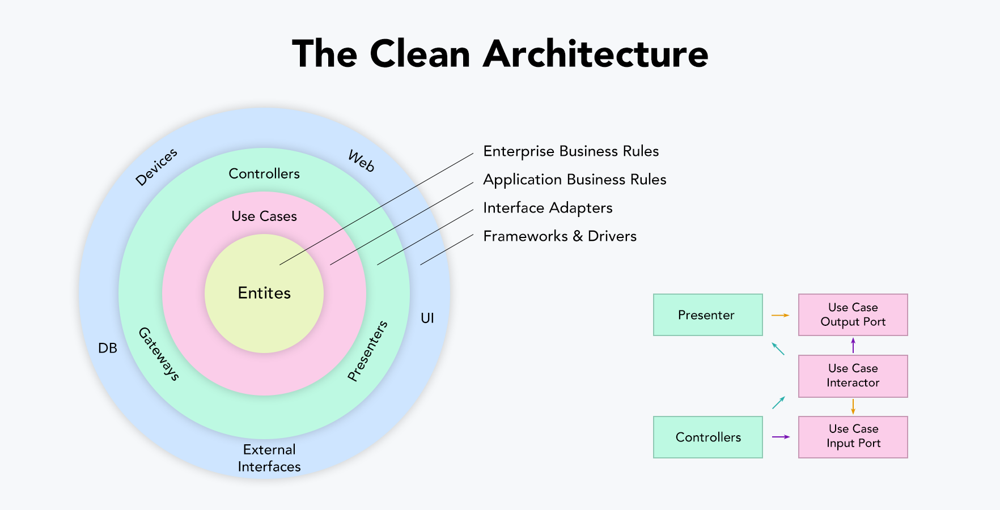
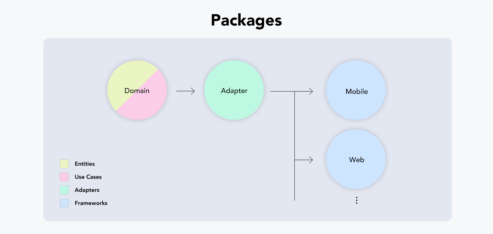
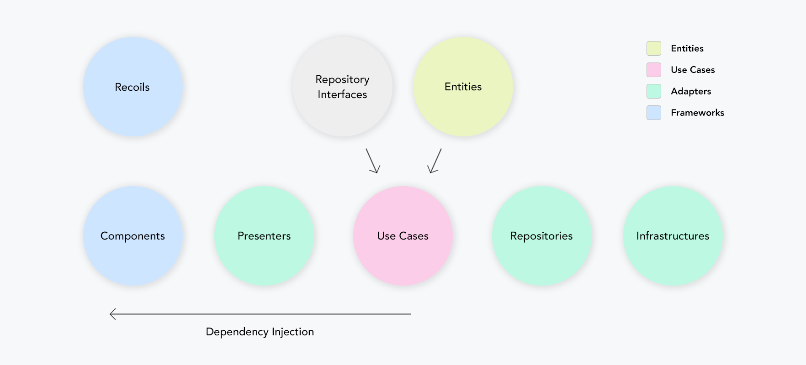
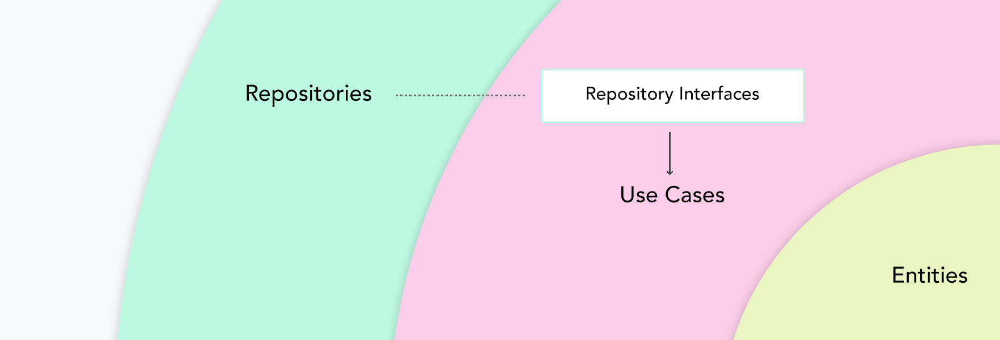

# mobile-react-native

# Overview 

[React Native](https://reactnative.dev/) - is Facebook's UI toolkit for building beautiful, natively compiled applications for Android and ios from a single codebase.

This is a micro-framework for React Native which is designed to help simplify developing apps. Every project provides a simple boilerplate to help you build apps easier.

This project is open source, we welcome any contributions.

# Getting Started 

- Node [install](https://nodejs.org/en/download/)
- HomeBrew [install](https://brew.sh/) (for mac os)
- brew install node (for mac os)
- brew install watchman (for mac os)
- Android Studio [install](https://developer.android.com/studio?gclid=CjwKCAiAheacBhB8EiwAItVO24q1KSBqPUAUZSTnyRqnyI5ksz6VHo9xELBTH2QpdRbsw8L8Z7F3vxoCGjEQAvD_BwE&gclsrc=aw.ds)
- Xcode [install](https://developer.apple.com/xcode/)

# Setup

To set up your project based on this boilerplate, you need to do some of the steps you need to do.

Here are the steps for setting up a Project with this React Native boilerplate:

## Step 1:

In this step you need to download(cloning) the files from this repository to your local computer:

```sh
git clone https://github.com/NeoSOFT-Technologies/mobile-react-native.git
```

or 

```sh
git clone git@github.com:NeoSOFT-Technologies/mobile-react-native.git
```

## Step 2:

The next step is to open the folder that has been downloaded / cloned into a cli application such as bash, cmd, terminal .

After cloning the repo and follow these steps to setup the project


# Architecture

The architecture of the template facilitates separation of concerns and avoids tight coupling between it's various layers. The goal is to have the ability to make changes to individual layers without affecting the entire app. This architecture is an adaptation of concepts from [Hexagonal Architecture](#) & [Clean Architecture](#)

 ## Hexagonal Architecture 
The idea of representing this architecture with a hexagon is due to the ease of associating the theoretical concept with the visual concept. Inside this hexagon is where our base code is located. This part is called ```domain```.

Each side of this hexagon represent an interaction with an external service, for example: http services, db, rendering..


The communication between ```domain``` and the rest of actors is performed in the ```infrastructure``` layer. In this layer we implement a specific code for each of these technologies.

 ## Clean Architecture

As with various architectures, the primary purpose of a clean architecture is to separate concerns. Divide the hierarchy according to each interest, design domain-centric rather than detailed implementation, and make sure that the internal area does not depend on external elements such as the framework or database UI.

- Distinguish between detailed implementation areas and domain areas.
- Architecture does not depend on the framework.
- The outer zone can depend on the inner zone, but the inner zone cannot depend on the outer zone.
- Both high-level and low-level modules rely on abstraction..

# Monorepo

The monorepo package consists of the above. The domain area, adapter area, and framework area are each configured as a package and designed to be more clearly distinguished. New services can be configured by adding packages from the framework area.

## Communitaction Flow

communication-flow-v8
in simple diagram, it is as above.

### Board
Board posts and comments are fetched through http communication from 'Infrastructures', encapsulated as Board Root Entity including Comment Entity in 'Use Case' and delivered to 'Presenter', and 'Presenter' returns Entity data.  
in 'Components', 'Entity' data or 'View Model' encapsulated data is stored in the state management manager, and the view is redrawn according to the state change of the data.


# Inversion of Control

In the case of 'Repository', it is an adapter layer, so you should not know about 'Repository' in 'Use Case'. Therefore, in 'Use Case', it is implemented through the Repository Interface located in the domain layer, which is then operated through Dependency Injection.

## Settings
### Package
#### Lerna
> /lerna.json
```js
{
  "packages": ["packages/*"],
  "npmClient": "yarn",
  "useWorkspaces": true,
  "version": "0.0.1"
}

```
#### Package
> /package.json
```js
{
  ...
  "workspaces": {
    "packages": [
      "packages/**"
    ],
    "nohoist": [
      "**/mobile",
      "**/mobile/**"
    ]
  }
  ...
}
```

 ## Layers

 The architecture is separated into the following layers
 
 - [app](#) - All UI and state management elements like components, screen and view models.
 - [core](#) - Core business implementation
   - [domain](#) - Use cases for individual pieces of work.
   - [data](#) - Repositories to manage various data sources.
   - [shared](#) - Common items for core module shared between domain & data.

 - [infrastructure](#) - Services provide access to external elements such as databases,apis, etc.
   - [database](#) - Database Provider
   - [network](#) - Axios for network setup

   Each layer has a di directory to manage Dependency Injection for that layer.
   Read the [dependency management documentation](#) to learn about all the scripts used in the project.

# Flavors
  The template comes with built-in support for 3 flavors. Each flavor uses a different ``` 
  main.ts ``` file.

   - Dev - [main_dev.ts](#)
   - QA - [main_qa.ts](#)
   - Prod - [main.prod.ts](#)

# Entities
The layers ```core``` and ```services provider``` within infrastructure each have an ```model``` directory.

 - [app layer](#): We consume the same models used from core/domain as domain wont change in the case of frontend apps.
 - [core layer](#): Model classes for performing business logic manipulations. They act as an abstraction to hide the local and remote data models.
 - [infrastructure](#): Respective service provider contains local models (data classes for the database) and remote models (data classes for the api).   

# Features
  - [Hexagonal Clean Architecture](#)
  - Monorepo
  - Adhering to SOLID Principles
  - Repository Pattern for code separations
  - [Dependency Injection](#)
  - Network Layer
  - Data Layer
  - Built-in support for 3 [flavors](#) - ``` dev ```, ``` qa ``` and ``` prod ```.
  - Unit & Integration Tests
  - CI for build release
  - Crashlytics/Analytics
  - [Localisation](#)
  - Routing/Navigations
  - [Responsive Framework](#)

# Libraries & Tools Used
  - Dependency Injection 
  - Network - [axios](#)
  - Database
  - Code Analysis 
  - Crashlytics - [Firebase](#)
  - Continuous Integration - Github Action
  - Navigation - [stack,bottom_tabs,Drawer](#)
  - Localisation
  - Responsive Farmework

  ## Run Projects
### 1. install
#### Install
```shell
$ yarn install
```

### 2. Mock Server
#### Start
```shell
$ yarn run mock-server
```

### 3. Web
#### Start
```shell
$ yarn run web
```

### 4-1. Mobile(iOS)
#### Install
```shell
# $ cd /packages/mobile/ios
$ pod install
# $ cd ../../../
```
#### Start
```shell
$ yarn run ios
```

### 4-2. Mobile(Android)
#### Start
```shell
$ yarn run android
```


# Modules
  ## List of Default Modules
  By default when you use this boilerplate, there are several modules that are installed automatically, here is a list of available modules:

  | Name | Description |
  | ------ | ------ |
  | [app](#)| A module containing boilerplate app view implementation |
  | [core](#)| A module containing core business implementation of the product which includes data,domain & shared modules|
  | [dependency-injection](#) | A module that contains classes to achieve DI across multiple modules based on ```injectable ```
  | [infrastructure](#) | A module that includes all external data providers/adapters which are outbound adapters to ```core``` module/ports. Further includes ```database``` & ```network``` external ports.|
|[localisation](#)| A module containing translation data |
